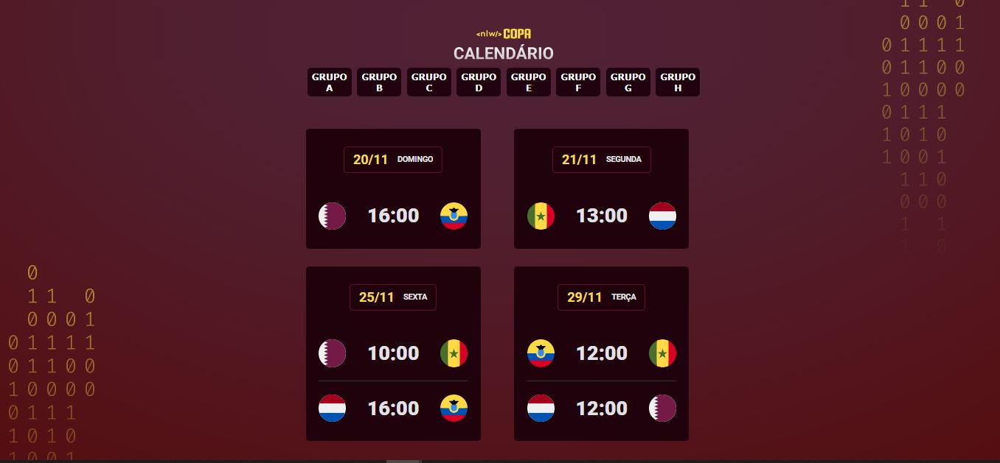

<h1 align="center"> Projeto de Calendário pessoal da Copa 2022 </h1>

# Evento promovido de forma gratuita pela Rocketseat

  

 

# 🛠️ Tecnologias
<h4>Esse projeto foi desenvolvido com as seguintes tecnologias:</h4>
- HTML E CSS 
- Javascript 
- Git e Github 
- Figma 
 

# 👨‍🎓 O que aprendi

- Configurar a aparencia do VScode
- Trabalhar com as informações do Figma
- Compreender melhor as animações no CSS
- Como refatorar as informações no JavaScript

## Layout

Você pode visualizar o layout do projeto através  [DESSE LINK](https://www.figma.com/community/file/1169028052212317700). É necessário ter conta no Figma para acessá-lo.

# 📧 Contato
<a href = "mailto:victorhcraposo@gmail.com">
 

